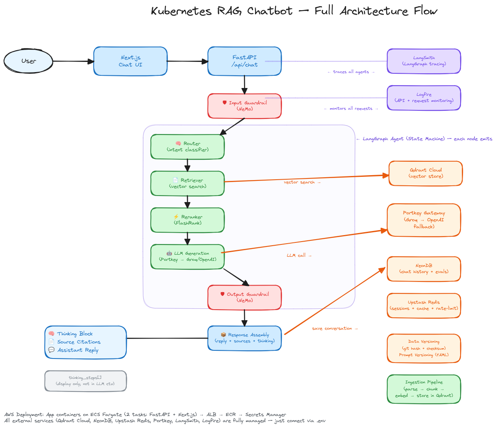

# Kubernetes RAG Chatbot

An AI-powered Kubernetes assistant using RAG (Retrieval-Augmented Generation) with LangGraph, Portkey LLM gateway, Gemini embeddings, and Qdrant vector store.

## Architecture



**Pipeline**: User Query → Input Guard → Router → Retrieve (Qdrant) → Rerank (FlashRank) → Generate (Groq via Portkey) → Output Guard → Response

## Stack

| Component | Technology |
|-----------|------------|
| Frontend | Next.js 15 (App Router, Tailwind, TypeScript) |
| Backend | FastAPI (Python 3.11, asyncpg) |
| Agent Framework | LangGraph (6-node linear pipeline) |
| LLM Gateway | Portkey (Groq primary → OpenAI fallback) |
| Embeddings | Gemini `gemini-embedding-001` (3072d) |
| Vector Store | Qdrant Cloud (COSINE distance) |
| Reranker | FlashRank `ms-marco-MiniLM-L-12-v2` |
| Database | NeonDB (PostgreSQL) |
| Cache | Upstash Redis |
| Tracing | LangSmith + Logfire |
| Deployment | Docker → ECR → ECS Fargate |

## Setup

### Prerequisites

- Python 3.11+ (uv)
- Node.js 20+
- Docker (optional)

### Environment

```bash
cp .env.example .env
# Fill in: PORTKEY_API_KEY, GROQ_API_KEY, QDRANT_API_KEY, GEMINI_API_KEY,
# NEON_DB_URL, UPSTASH_REDIS_REST_URL, UPSTASH_REDIS_REST_TOKEN,
# LANGSMITH_API_KEY, LOGFIRE_TOKEN
```

### Backend

```bash
cd backend
uv sync
source .venv/bin/activate
uvicorn app.main:app --host 0.0.0.0 --port 8000
```

### Frontend

```bash
cd frontend
npm install
npm run dev  # → http://localhost:3000
```

### Ingest Documents

```bash
curl -X POST http://localhost:8000/api/ingest
```

## API Endpoints

| Method | Path | Description |
|--------|------|-------------|
| POST | `/api/chat` | Ask a Kubernetes question |
| GET | `/api/chat/{id}/history` | Conversation history |
| POST | `/api/chat/upload` | Upload a file |
| POST | `/api/ingest` | Ingest documents into Qdrant |
| POST | `/api/conversations` | Create conversation |
| GET | `/api/conversations` | List conversations |
| GET | `/api/conversations/{id}` | Get conversation |
| DELETE | `/api/conversations/{id}` | Delete conversation |
| POST | `/api/conversations/{id}/star` | Toggle star |
| GET | `/api/health` | Health check |
